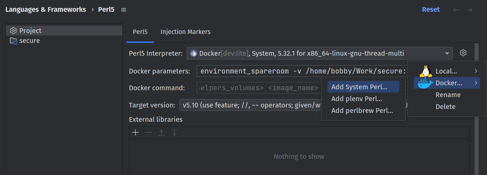
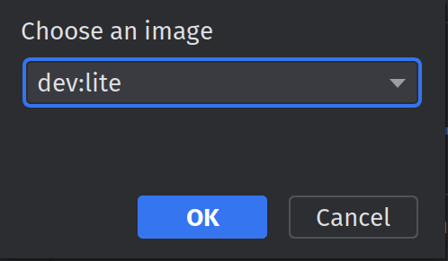
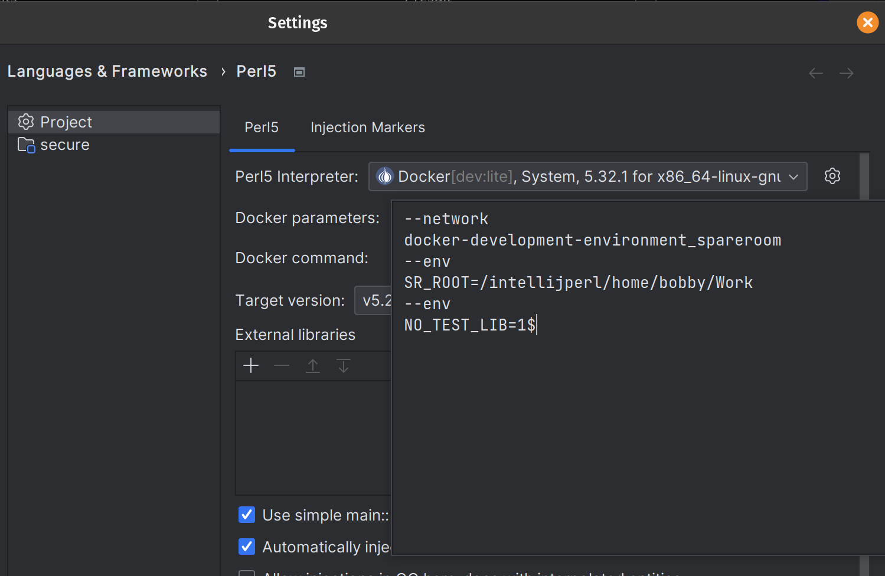
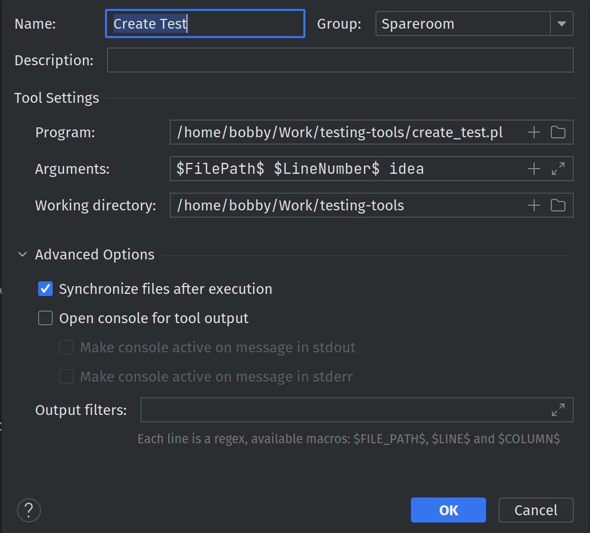
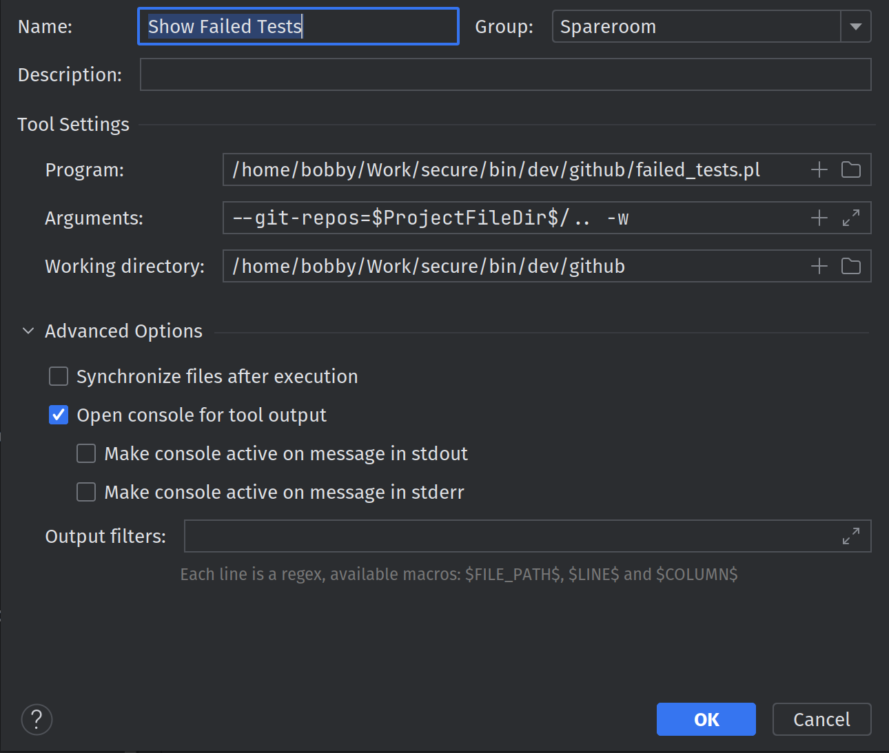
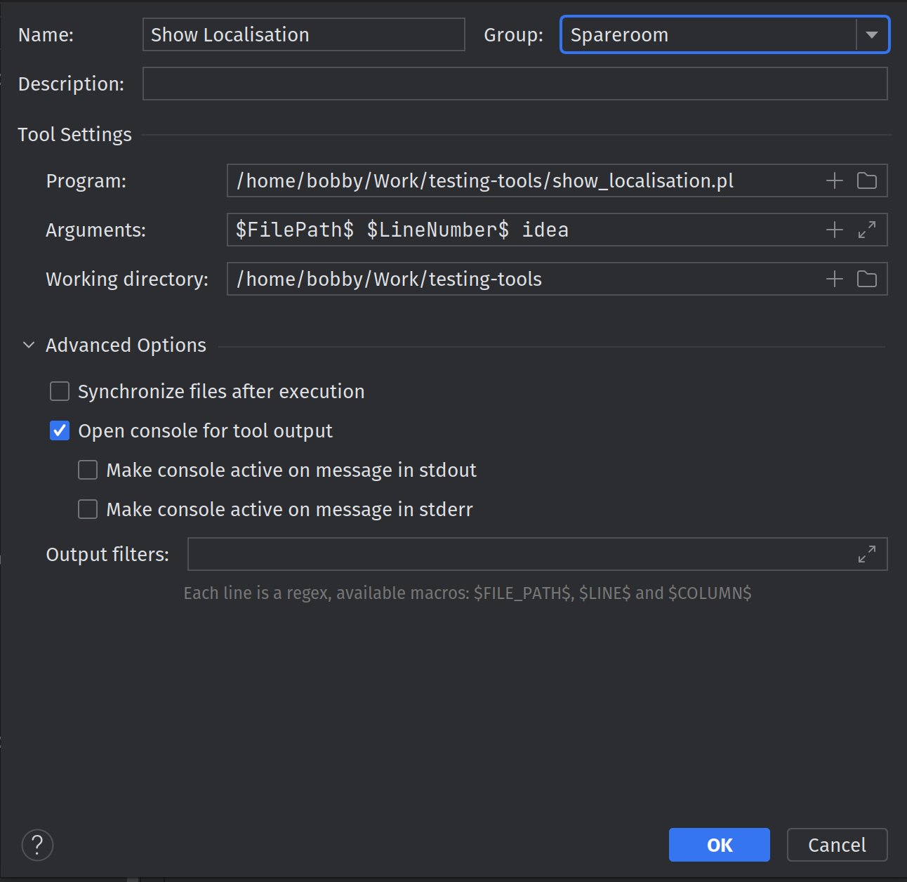
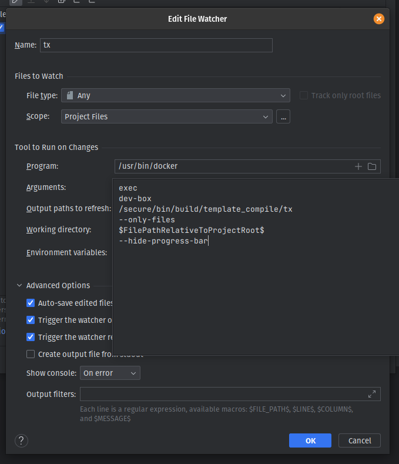

# Tools for IntelliJ IDEA

## Perl Plugin

Install the Perl plugin from the IntelliJ IDEA plugin repository.
Cmd+Shift+A (or Ctrl+Shift+A) and search for "Plugins", then search for "Perl".

### Perl Plugin Setup for Secure

#### Replace your .idea/secure.iml with the one from this repository

```shell
cp $SR_ROOT/testing-tools/secure.iml $SR_ROOT/secure/.idea/secure.iml
```

#### Build dev-lite docker image

The following command builds an image and adds it to your local
registry.

```shell
cp $SR_ROOT/docker-development-environment/dev/dot-my.cnf $SR_ROOT/testing-tools/dev-lite/dot-my.cnf
docker build dev-lite -t dev:lite
```

#### Add docker image





#### Run with network & volume parameters (making sure dev env is already up)



```
--network
docker-development-environment_spareroom
--env
SR_ROOT=/intellijperl/home/bobby/Work
```

Now you should be able to run and debug perl tests 
right from the editor.

## [sr-bashrc.sh](sr-bashrc.sh)

I have provided a bashrc file that provides many useful aliases.
You must at least have `$GIT_REPOS` set to wherever you store your repos.
Add the following to your .(ba|z)shrc:

```shell
export GIT_REPOS=~/Work # Or whatever it is you use
source $GIT_REPOS/testing-tools/sr-bashrc.sh
```

## External Tools

To add external tools, go to Settings > External Tools







## Live Templates

```xml
<template name="mock" value="my $$$MOCK_NAME$_mock = mock &quot;$PACKAGE_NAME$&quot; =&gt; (&#10;    override =&gt; [&#10;        $FUNCTION_NAME$ =&gt; sub {&#10;            $END$&#10;        }&#10;    ],&#10;    track =&gt; 1,&#10;);&#10;" description="mock" toReformat="false" toShortenFQNames="true">
  <variable name="MOCK_NAME" expression="" defaultValue="" alwaysStopAt="true" />
  <variable name="PACKAGE_NAME" expression="" defaultValue="" alwaysStopAt="true" />
  <variable name="FUNCTION_NAME" expression="" defaultValue="" alwaysStopAt="true" />
  <context>
    <option name="PERL5_TEST_FILE" value="true" />
  </context>
</template>
<template name="timestone" value="for (t::time_stone(time =&gt; &quot;$YYYY$-$MM$-$DD$T$HH$:$MIN$:$SS$Z&quot;)) {&#10;    $SELECTION$$END$&#10;}" description="" toReformat="false" toShortenFQNames="true">
  <variable name="YYYY" expression="" defaultValue="2023" alwaysStopAt="true" />
  <variable name="MM" expression="" defaultValue="09" alwaysStopAt="true" />
  <variable name="DD" expression="" defaultValue="01" alwaysStopAt="true" />
  <variable name="HH" expression="" defaultValue="00" alwaysStopAt="true" />
  <variable name="MIN" expression="" defaultValue="00" alwaysStopAt="true" />
  <variable name="SS" expression="" defaultValue="00" alwaysStopAt="true" />
  <context>
    <option name="PERL5_TEST_FILE" value="true" />
  </context>
</template>
<template name="st" value="subtest &quot;$NAME$&quot; =&gt; sub{&#10;    $SELECTION$$END$&#10;};" description="subtest" toReformat="true" toShortenFQNames="true">
  <variable name="NAME" expression="" defaultValue="" alwaysStopAt="true" />
  <context />
</template>
<template name="lb" value="has $PROP_NAME$ =&gt; (is =&gt; 'ro', isa =&gt; '$PROP_TYPE$', lazy_build =&gt; 1);&#10;sub _build_$PROP_NAME$ {&#10;    $END$&#10;}" description="lazy builder" toReformat="true" toShortenFQNames="true">
  <variable name="PROP_NAME" expression="" defaultValue="" alwaysStopAt="true" />
  <variable name="PROP_TYPE" expression="" defaultValue="" alwaysStopAt="true" />
  <context>
    <option name="PERL5_PREFIX" value="true" />
  </context>
</template>
```

## TX File Watcher

Set up this file watcher to automatically compile templates when you edit them.



```
exec
dev-box
/secure/bin/build/template_compile/tx
--only-files
$FilePathRelativeToProjectRoot$
--hide-progress-bar
```

## IdeaVim Config

Sync your changes to this repo:
```shell
cp ~/.ideavimrc $GIT_REPOS/testing-tools/$USER.ideavimrc
```

Get your ideavimrc:
```shell
cp $GIT_REPOS/testing-tools/$USER.ideavimrc ~/.ideavimrc
```

### TODO

- Code templates
- 1Password setup
- VPN connect