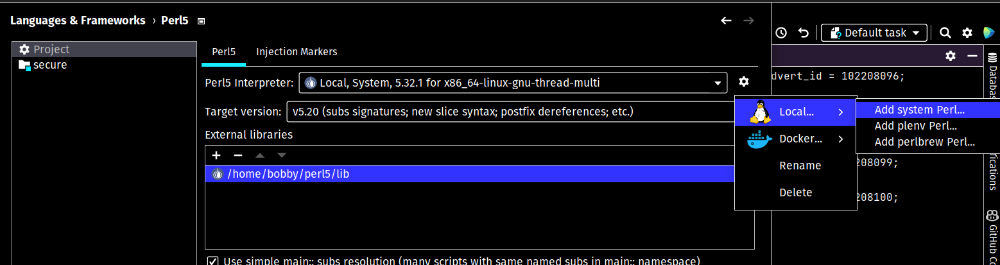
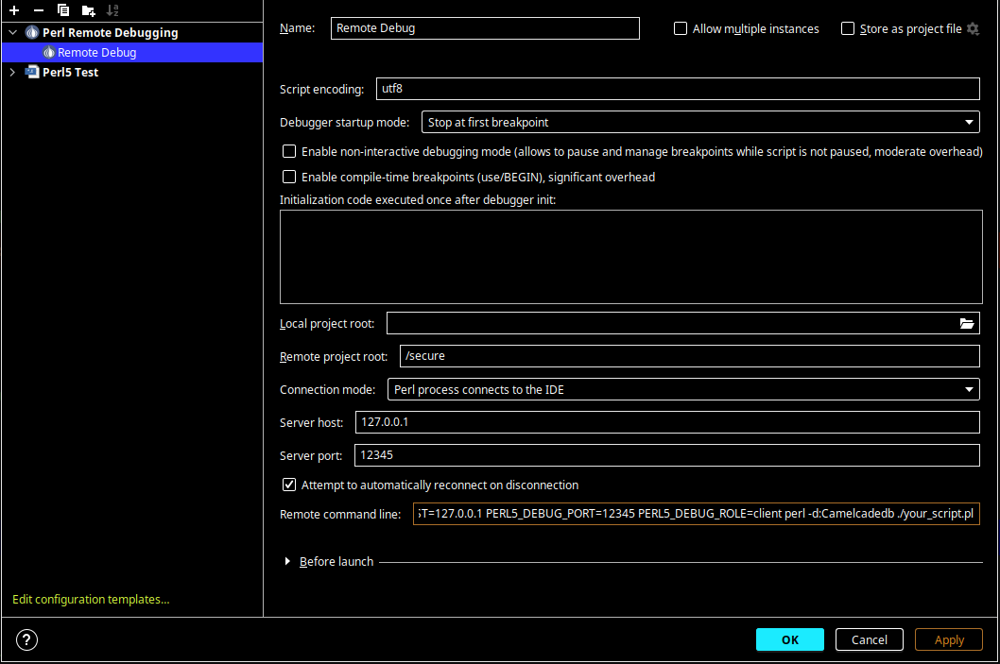
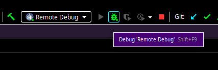
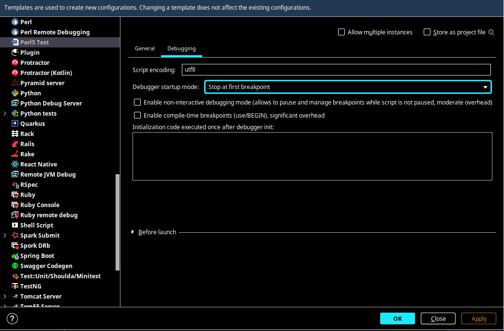
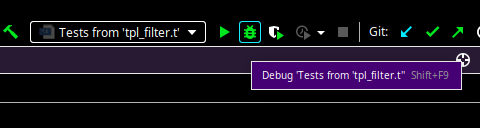
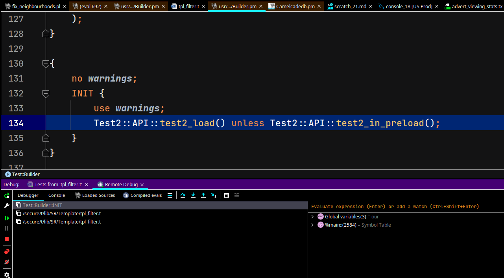
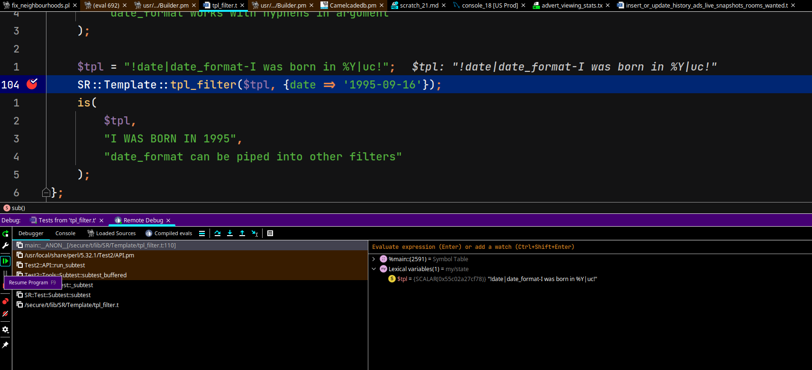

# Tools for IntelliJ IDEA

## Perl Plugin

Install the Perl plugin from the IntelliJ IDEA plugin repository.
Cmd+Shift+A (or Ctrl+Shift+A) and search for "Plugins", then search for "Perl".

## SR-Bashrc

I have provided a bashrc file that provides many useful aliases.
It assumes that you store your work repos in ~/Work, but you can change this
by editing the bashrc file.
I recommend that you source the file in your ~/.bashrc file.

## docker-perl.pl

This is a script for running Perl code from the IntelliJ plugin.

Then choose the docker-perl.pl script as the interpreter. It is a script designed to trick
IntelliJ into thinking it's running local perl, but it's actually using the dev-box.

## External Tools

TODO: Export my external tools.

## Running Tests

Now that perl is set up, you should be able to run tests as normal from IntelliJ.

## Debugging

The debugger for Perl works in a client-server architecture.
The Perl plugin injects a client into the code that you are debugging, which
connects to the server running in IntelliJ. Unfortunately, this means that
you have to run an additional process for debugging. Here is how to set that up.

First add a run configuration for Perl5 Remote Debug. Make sure that
'Attempt to automatically reconnect on disconnection' is checked, and that
Debugger startup mode is set to 'Stop at first breakpoint'.

For some reason it always stops inside Test2 first, so you'll need to step over
that to get to your code.

It should look like this:

Start the Remote Debug - you usually want to keep this running.

I recommend that you change the Perl5 test template to stop on first breakpoint:

Then debug a test using the "Debug Test" button:

The debugger connects and stops here:

Press F9 (resume program) to get to your breakpoints:

### TODO

- External tools
- Live templates
- Code templates
- 1Password setup
- VPN connect